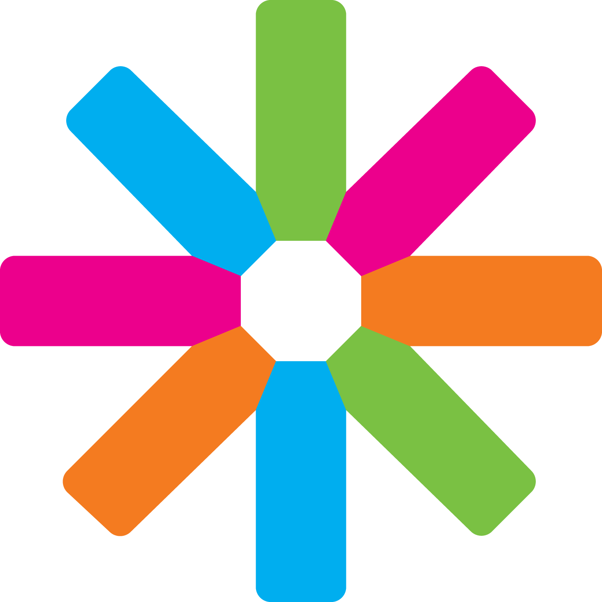

# Hi there, I'm Axel! 👋

<div align="center">
  
[](https://git.io/typing-svg)


</div>

## 🚀 About Me

I'm a **Physics & Mathematics student** at NTNU with a focus on data science and statistics. Currently working part-time as an **AI Engineer** while finishing my master's degree. I enjoy building software, though I'm more of a data person than a traditional developer.

- 🎓 **MSc Student** - Physics & Mathematics at NTNU (Industrial Mathematics specialization)
- 📊 **Data Scientist/Statistician** - With a growing interest in software development
- 🤖 **AI Engineer** - Part-time at Kongsberg Discovery, working on computer vision systems
- 💼 **Previous Experience** - Data/software roles at ABAX and KPMG
- 🇮🇹 **Exchange Student** - 1 year Mathematical Engineering @ Politecnico di Milano (AI & Deep Learning focus)
- 🇯🇵 **Exchange Student 2** - Studied a semester at Graduate School of Engineering @ Kyushu University, Japan

## 💻 Tech Stack & Tools

<div align="center">

### 🚀 Languages & Frameworks


### 🤖 AI/ML & Data


### ☁️ Cloud & Tools


</div>


## 💼 Current Work

```python
class AxelHagen:
    def __init__(self):
        self.status = "MSc Student & Part-time AI Engineer"
        self.current_focus = "Computer vision systems at Kongsberg Discovery"
        self.education = "Physics & Mathematics @ NTNU"
        
        self.work_experience = [
            "Kongsberg Discovery (AI Engineer - current)",
            "KPMG (Software Engineer)",
            "ABAX (Software Engineer)"
        ]
        
        self.currently_working_on = [
            "AI models for underwater imaging",
            "Statistical analysis and data modeling",
            "Thesis research in industrial mathematics",
            "Learning web development on the side"
        ]
    
    def daily_routine(self):
        return "Classes, coding, and solving interesting problems 🤓"
```

## 🎯 Approach

I like building things that actually work and are useful to people. No need to overcomplicate it - just good software that solves real problems.

## 🌍 Other Stuff

-  **ESN** - ESN volunteer, organizing big trips (100+ people) for exchange students in Trondheim
- 🎙️ **Podcasting** - Host for Engineers Without Borders Podcast
- ⚡ **Events** - Enjoy organizing and bringing people together
- 🏔️ **NTNUI Skiing and Mountaineering** Member of the Social Comittee, organising more lowkey events for the organisation.

## 🤝 Let's Connect!

<div align="center">

[](https://linkedin.com/in/axelhagen/)
[](mailto:axel.hagen@hotmail.com)
[](https://github.com/axelfhagen)

<br>


### 💭 *"Turning data into insights, and occasionally into software"* 📊


</div>
